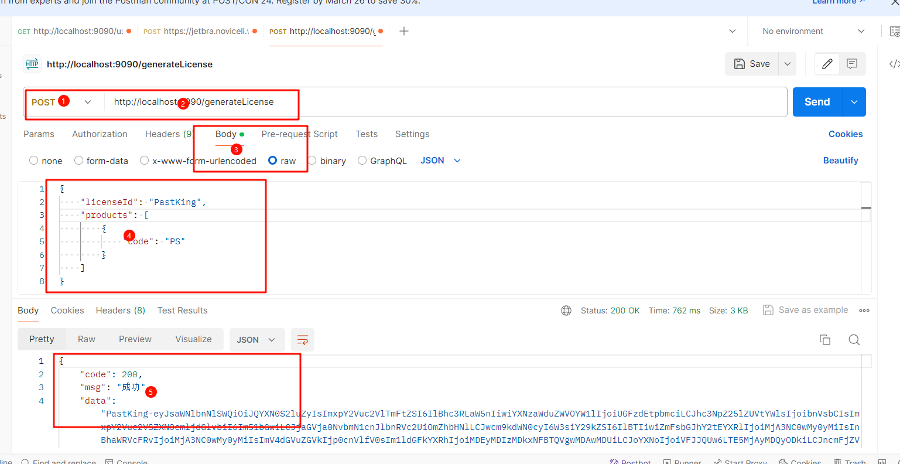

### 功能特点
- 接收包含许可证信息的JSON请求。
- 使用BouncyCastle库生成RSA密钥对和X.509证书。
- 根据请求中的许可证信息生成许可证内容。
- 对许可证内容进行数字签名。
- 将许可证、数字签名和证书编码为Base64字符串。
- 返回Base64编码后的许可证数据作为JSON响应。

## 技术栈
- Java
- Spring Boot
- BouncyCastle
- JSON
- Base64

## 项目结构
```
src
├── main
│   ├── java
│   │   └── com
│   │       └── example
│   │           ├── controller
│   │           │   └── LicenseController.java
│   │           ├── entity
│   │           │   ├── LicensePart.java
│   │           │   └── Product.java
│   │           └── utils
│   │           │   ├── CertificateGenerator.java
│   │           │   └── PowerConfRuleGen.java
│   └── resources
│       └── application.properties
└── test
    └── java
        └── com
            └── example
                └── controller
                    └── LicenseControllerTest.java

```

## 实体类
- **LicenseRequest**: 接收HTTP请求中的许可证信息。
- **Product**: 产品实体类，包含产品代码。
- **Result**: 通用响应结果实体类，用于封装响应数据。

## 控制器类
- **LicenseController**: 处理生成许可证请求的控制器类，接收LicenseRequest并返回Base64编码的许可证数据。

## 工具类
- **CertificateGenerator**: 证书生成器，用于生成RSA密钥对和X.509证书，并将其写入文件。

## 接口使用方法

#### 1. 生成许可证接口

- **URL**: `/generateLicense`

- **请求方法**: POST

- **请求参数**:

    ```json
    {
        "licenseId": "PastKing-Yi",
        "products": [
                        "code": "PS"
            }，
            {
            	"code" : "II"
            }
        ]
    }
    ```

    

- **返回示例**:

    ```json
    {
        "code": "200",
        "message": "Success",
        "data": "PastKing-Yi-eyJsaWNlbnNlSWQiOiJQYXN0S2luZy1ZaSIsImNvZGUiOlsiUFMiXSwiZGF0ZSI6IjIwOTktMTIiLCJzaWciOiJmN2E4NmVlMWMxNzVlMDkyZTlmMTgwN2I1MTQ3NzBmOTU0YjlkZGEyZGYyOWM3ZDlhZjcyZjU2NzNlYmI4ZGY0IiwiaXNzdWVyU2VydmljZUdyb3VwcyI6IlJlYWQiLCJzaWciOiJSU0EifQ=="
    }
    ```

## 部署计划

- 部署到服务器上时，将使用服务器上的文件路径而不是本地路径，以确保能够正确加载证书和私钥文件。

- 将生成的许可证文件保存到服务器上的安全目录中，以便应用程序能够访问并提供给客户端。

- 应该先执行`src/main/java/com/example/utils/CertificateGenerator.java`生成证书，然后执行`src/main/java/com/example/utils/PowerConfRuleGen.java`生成EQUAL,x,y,z->r，最后启动工程访问接口即可

    

